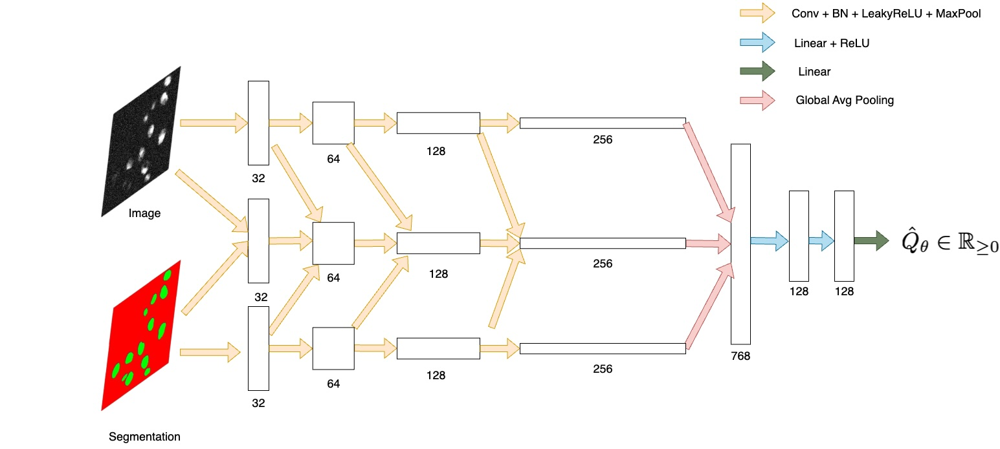
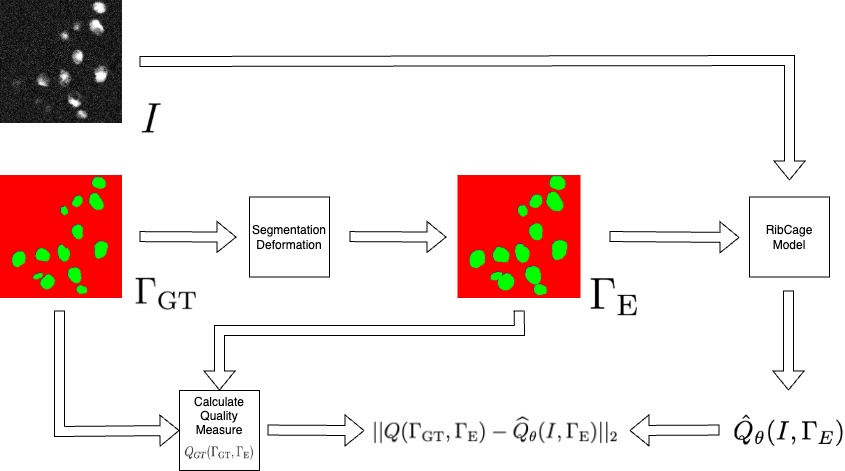
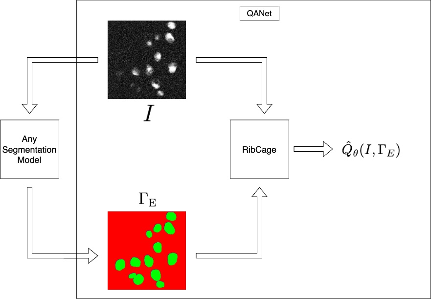

# QANet

QANet is a Quality Assurance Neural Network for evaluating instance segmentation results in microscopy images.

Unlike segmentation models, QANet does not generate segmentation masks. Instead, it receives an image and a proposed segmentation as input, and predicts a quality score estimating how good the segmentation is.


## Method Overview

QANet is based on the RibCage architecture, which compares the raw image and the evaluated segmentation across multiple feature levels.

The model is trained using synthesized segmentation errors generated from ground-truth masks. These errors include morphological operations and non-rigid perturbations, allowing the model to learn how different segmentation artifacts affect quality metrics.

## Architecture



## Training Pipeline



## Inference Pipeline



## How to Run

The main entry point is:

```text
QANet.ipynb
```

Open the notebook and run the cells in order.
